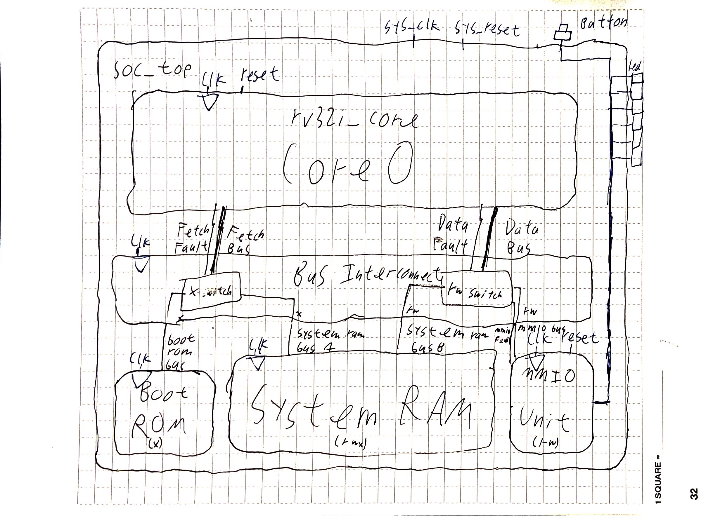
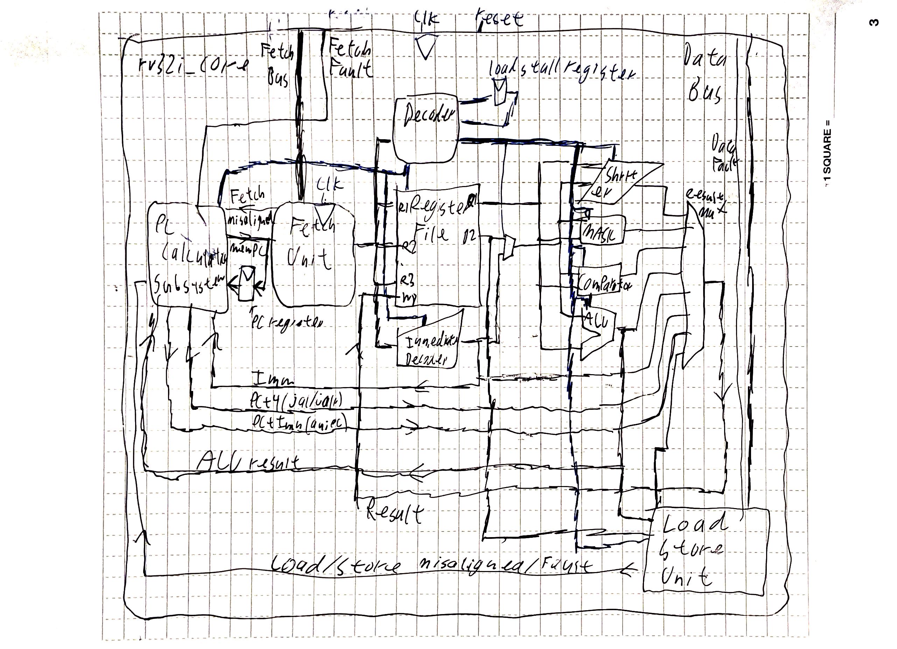

# nano-rv32i
This is a basic starter RV32I core. It is my first large hardware design project.

| Category | Component / Tool |
| :--- | :--- |
| **Target Hardware** | Sipeed Tang Nano 20K (Gowin GW2AR-LV18) |
| **HDL Language** | SystemVerilog |
| **Simulation** | Verilator |
| **Waveform Viewer** | Surfer |
| **Synthesis** | Yosys |
| **Place & Route** | NextPNR-Gowin |
| **Bitstream Tool** | Project Apicula |
| **Formal Verification** | `riscv-formal` and SymbiYosys |
| **CI/CD** | GitHub Actions |

## Design
### SoC Diagram

### Core Datapath


 - **Target:** This core is targeted for the **Sipeed Tang Nano 20K**
 - **Toolchain:** I use **SystemVerilog**, **Verilator**, **Yosys**, **NextPNR**, and **Project Apicula**.
 - **Architecture:** Uses the **RV32I Base Unprivileged Architecture**
 - **Microarchitecture:** Uses a **primarily Single-Cycle** architecture except for `load` instructions (see below).
 - **Memory:** Uses synchronous **Dual-Ported BRAM** for a seamless **Von Neumann** experience while maintaining the simplicity of a Harvard architecture in hardware.
 - **Fetching:** Calculates the next PC *combinationally* before feeding it into the synchronous BRAM. This eliminates the need for a dedicated fetch cycle while working with FPGA primitives.
 - **Loads & Stores:** Because memory is synchronous, loads and stores present a challenge. Stores calculate the address and present the data on the memory port. It is committed on the rising edge of the clock. Loads calculate the address and present it to the memory address port. On the next cycle the result is read from the data port, it is shifted/masked (if necessary), and is written back to the register file. The load delay is managed by a FSM in the decoder (the decoder is combinational with an external 1-bit register for a load flag).
 - **Tested and Verified:** Processor fully passes **riscv-tests**, **riscv-formal**, and the Verilator linter. Commits and PRs are tested using GitHub Actions.

## Limitations
  - **Misaligned Memory Accesses:** Currently, the core does not support misaligned memory accesses (`addr % 4 != 0` for words, `addr % 2 != 0` for halfwords). Since I am implementing an **Unprivileged Architecture**, I cannot currently add a **Trap Handler** to handle misaligned accesses.

## Getting Started
 - To use this processor, first set up the environment on your device. It is highly recommended to use the VSCode docker extension or GitHub Codespaces. If you have any difficulties setting up the environment, let me know. 
   - Note: I do not have a setup for running this on anything but x86 Linux currently. Sorry.
 - Put your executable RISC-V binary in the `build/target/bootloader.hex` for synthesis. Due to a silent bug in `gowin_pack` to initialize dual-ported Block RAM with data, this is currently the only way to run code on the physical FPGA. Note that the bootloader does not have rw privileges, only x priveleges, so the .data or .rodata sections should be excluded from this part.
 - Run the `synthesize` command. It should generate a bitstream.fs file in your repository root directory.
 - Flash the FPGA
   - Download or transfer the bitstream.fs file to your device with the USB port to flash the FPGA.
   - Install `openFPGALoader` on your device and run this command: ```openFPGALoader -b tangnano20k [path/to/bitstream.fs]``` This loads the bitstream onto the FPGA's SRAM. To flash the FPGA so that the design stays on permanently, add the -f flag.
 - To formally verify the processor, run the `test-formal` command. To run riscv-tests, run the `test-dynamic` command. To check linting, run the `lint` command.
## Current Status
 - Recently Accomplished:
   - Adding an automated riscv-tests script
   - Incorporating riscv-formal for **formal verification** of my processor.
   - Automating tests and verification via GitHub Actions
 - Next Up/In Progress:
   - Add a bootloader
   - Add an Assembly and C FSM blinker (see `linuxuser314/baremetal-blinker` for a similar example)
 - Future Plans:
   - Pipeline the processor
   - Integrate a high performance tightly-coupled memory
   - Add exception handling and the Zicsr extension
   - Add compressed instructions
   - Add multiplication extension

## Lessons Learned & Challenges Overcome
Throughout this process, I have spent many hours debugging weird quirks and trying to get my toolchain to work.
- **Learning SystemVerilog:** This is my first real SystemVerilog project, so I was getting familiar with the syntax of the language and its various oddities.
- **Icarus Verilog Limitations:** I had to modify various parts of my code so I could successfully use Icarus Verilog (`iverilog`) for simulation, since it does not support full modern SystemVerilog.
- **RISC-V GNU Toolchain:** Overcoming the complications of preprocessors, linker scripts, macros, and more.
- **RISC-V Tests:** Getting valid Verilog .hex files from assembly using the GNU toolchain and overcoming complex macro headers.
- `$readmemh` **and OSS CAD:** OSS CAD (specifically **Project Apicula** (`gowin_pack`) is apparently finicky when it comes to loading data into dual-ported Block RAM at startup. This caused hours of frustration and the classic "it works in simulation, but not in synthesis" error not because my code was incorrect, but because my toolchain was silently deleting my code and causing my processor to go into an error state when it fetched the first instruction from zeroed-out BRAM.
- **Toolchain Stress:** I had to take a week off because of the stress of trying to build a Python toolchain system. There were so many things going wrong... I wanted to write RTL, not navigate the UNIX tax of OSS EDA tools.

## Development Methodology

I learned about RISC-V using Sarah and David Harris's *Digital Design and Computer Architecture, RISC-V Edition* (2022). I used their SystemVerilog references, schematics, and appendices to design this core, expanding where they missed instructions and optimizing for synchronous memory.

Throughout this process I have used Google Gemini AI and GitHub Copilot for brainstorming, debugging, rubber-ducking, improvement suggestion, testbenches, and toolchain management (build scripts, linker scripts, quick assembly tests). 95% of the RTL is my own, but AI proved to be an invaluable tutor.
